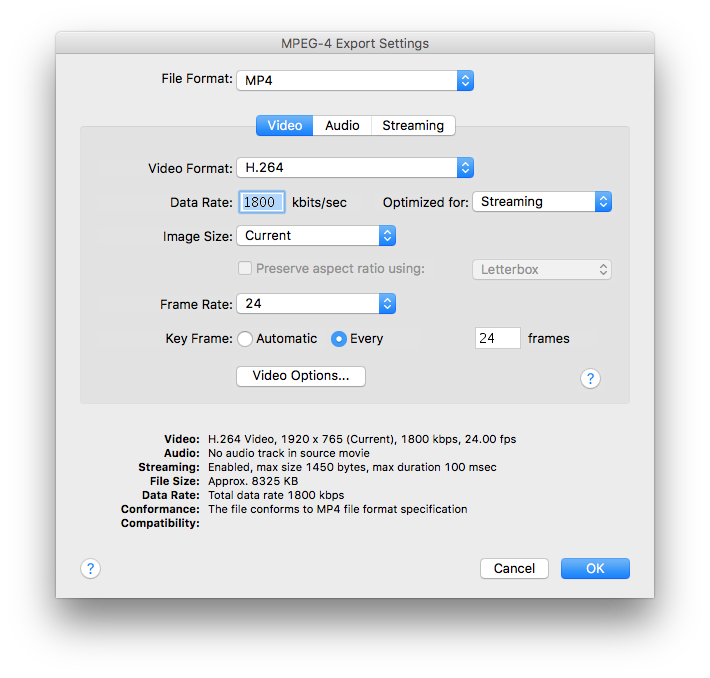

# Introduction

This is a custom-developed WordPress theme based on TwentySixteen.

## Homepage Video

The homepage video is chosen on the client’s side from several pre-generated sources based on the height of the container (`header.site-header`).

The dark gradient at the top should be rendered into the video.

To come up with a list of frame sizes to create new videos, measure the height of `.site-header` while changing the viewport width.

There are currently four static heights for `.site-header`, though I also created a 1920px-wide video for viewports >= 1600px.

Each framesize should be wide enough to cover the entire range of viewport widths for that given height.

| Viewport Width | Container Height | Framesize | Bitrate  |
|----------------|------------------|-----------|----------|
| >= 1600px      | 764px            |  1920x766 | 1800kb/s |
| 1600-985px     | 764px            |  1600x765 | 1500kb/s |
| 910-984px      | 570px            |   990x430 |  750kb/s |
| 710-909px      | 618px            |   920x620 |  700kb/s |
| <= 709px       | 532px            |   710x535 |  600kb/s |

More export details:

